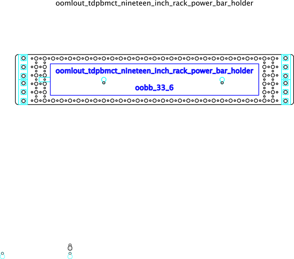

# 19 inch rack power bar holder, with oobb holes
A holder for a six outlet uk style power bar, with mounting holes for a 19 inch rack, and oobb holes. Designed for laser cutting.  
## dimensions
* width: 494 mm
* height: 89 mm
* width_oobb: 33
* height_oobb: 6
## parts
* oomp_hardware_bolt_4_mm_10_mm  x2
* oomp_hardware_nut_4_mm  x2
  

## corel working
 

